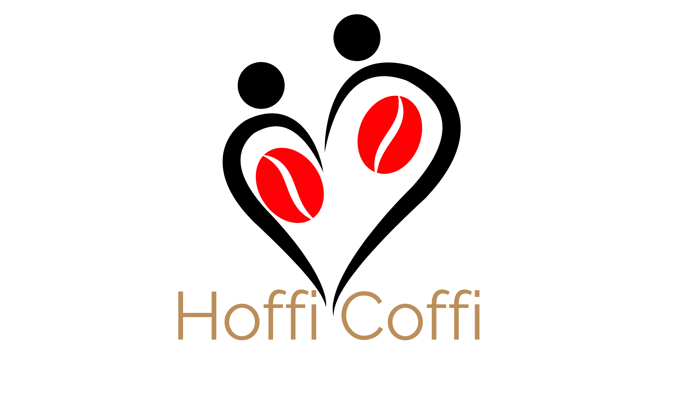
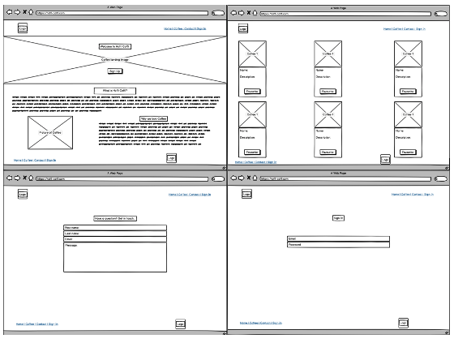
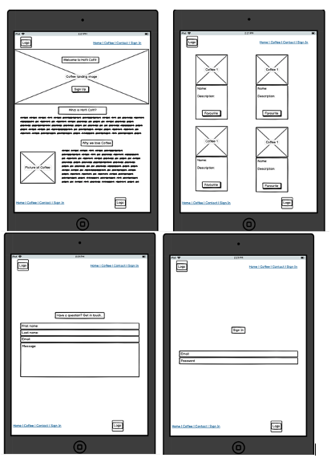
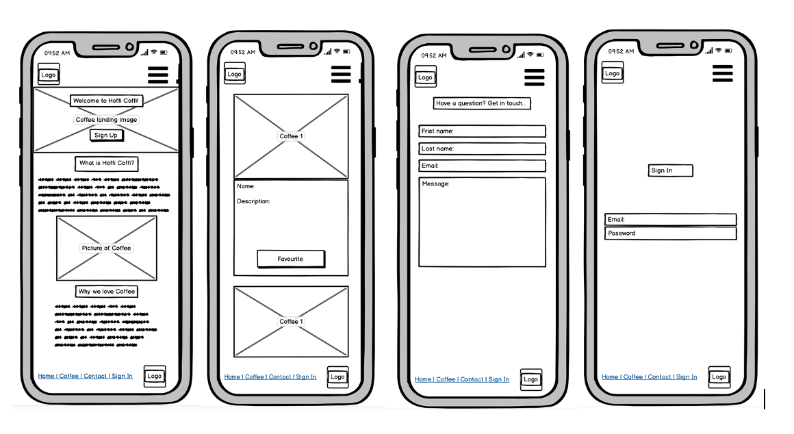

# Hoffi Coffi
---

## Introduction

Welcome to Hoffi Coffi, thats '**Love Coffee**' in the **Welsh language**. The app is designed to bring coffee drinkers like myself, together to choose their favourite coffees from a list of products. It will also allow people who have not tried certain coffees to see possible coffee's to try next. 

## UX
---

### User Stories 

*Generic User*

* As a user, I want to be able to **learn** about a variety of coffees. 

* As a user, I want to be able to **keep up to date** about my favourite coffees from the list of products. 

* As a user, I want to be able to **request** my favourite coffees be added to the site. 

*Developers Goals* 

* As a developer, I want to be able to create a usable app. 

* As a developer, I want to be able to increase the passion for coffee. 

### Design 

1. **Logo** 
The logo was created using [Free Logo Maker](https://logomakr.com). It was designed to to show the love for coffee that can be shared by two people. The coffee beans are used in place of a heart and colored red to symbolise this. This logo can be seen at the top of this page. 

2. **Colour Scheme**

The colours for the website were chosen using [Coolors](https://coolors.co/fdecfb-a97160-dfbe99). They were chosen with the aim to represent coffee and the love that goes into it. The chosen colours are:

*  '#654321' - Dark Brown
*  '#A97160' - Blast of Bronze
*  '#DFBE99' - Tan

3. **Fonts**

The website has the main font of Roboto Slab, which was chosen due to it **readability to all users**. Furthermore, it modern which will fit with the aim of the website. It was chosen using [Google Fonts](https://fonts.googleapis.com/css2?family=Roboto+Slab&display=swap) and has the default of Sans Serif. 

4. **Wireframes**

The wireframes for this website where created using [Balsamiq](https://balsamiq.com/wireframes/?gclid=CjwKCAjwltH3BRB6EiwAhj0IUBrAHe-2BiRjQmQGSO-FZIjoEjkckL_kVyJXd5ShGVwKqDaDMqKjvBoCQksQAvD_BwE)

## Features
---

### Existing Features

The features that were added to the project were designed to have a high level of usability.

* The **logo** will be wrapped in anchor tags which will allow the user to click on it to return to the home page. 
* The **Navbar** will have links to home, coffee, contact and sign in which will allow the user to easily navigate around the page. It will also be a sticky navbar to help users navigate when they are scrolling through the page.
* The **hamburger menu** will be used on mobile phone to allow the user to navigate their way around the website easily without overcrowding the screen. 
* The **home page** will incorporate a landing image of coffee with a the option for the user to sign up to the website. There will also be a welcome message to the website. 
* The **coffee page** will allow users to view a variety of coffees. It will display their names and a short description below a picture of each. 
* **Favourite** The user will be able to favourite any coffee they wish to, once they have created an account. 
* The **sign up** page will allow the users to create an account. This will allow them to keep track of the coffees that they like.
* The **contact form** allows the user to get in contact with any questions that they may have. 
* The **footer** will allow the user to naviagte to other pages with a menu and will show the hoffi coffi logo. 

### Features Left to Implement

* The option for users to **buy the coffee** that they like through the website.
* For users to be able to add thier **own choices** on the website. 

## Technologies Used
---
### **Languages:**

### **Languages:**

* HTML
* CSS
* JavaScript
* JSON
* Python 

## **Frameworks and Libraries**

* [Bootstrap](https://getbootstrap.com/)
* [Font Awesome](https://fontawesome.com/)
* [Google Fonts](https://fonts.google.com/specimen/Lato?sidebar.open&selection.family=Lato)

### **Tools Used**

* [Coolors](https://coolors.co/3c1642-086375-1dd3b0-fffdfd-ffffff) 
* [Balsamiq](https://balsamiq.com/wireframes/?gclid=CjwKCAjwltH3BRB6EiwAhj0IUBrAHe-2BiRjQmQGSO-FZIjoEjkckL_kVyJXd5ShGVwKqDaDMqKjvBoCQksQAvD_BwE)
* [Free Logo Maker](https://logomakr.com)
* [Gitpod Online IDE](https://www.gitpod.io/)
* [Github](https://github.com/)
* [Favicon Creator](https://www.favicon.cc/?action=import_request)

## Testing
---

## Deployment 
---

## Credits
---

***This project is fictitous and was created for educational purposes as part of the Code Institute Milestone Project 3***

